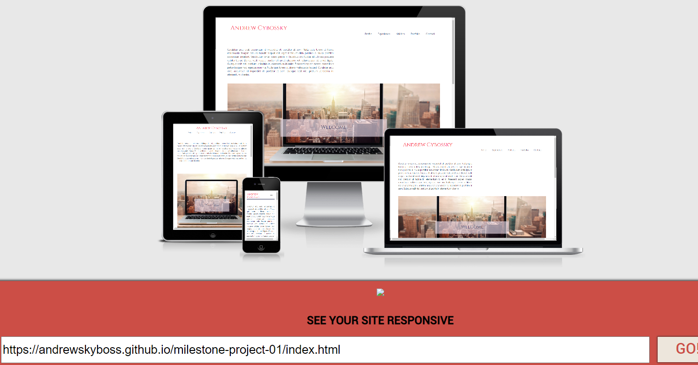

# milestone-project-01 User Centric Front-End Development / Portfolio
Milestone Project 01  Andrew Cybossky Portfolio
- 
- [Link to a deployed project](https://andrewskyboss.github.io/milestone-project-01/index.html)  Andrew Cybossky Portfolio website.

## Author
Andrej Cybovskij

## Project Overview
- Below is a picture of site that shows it in responsive states. 
[link to check a website to be responsive](http://ami.responsivedesign.is)

- The project idea is to create a personal portfolio website (for Andrej Cybovskij). 
	This websites goal is to represent Autor for potential Employers and Recruiters in a best light and get hired. 
    The main users of this website are a business people and their representatives. 
    The websites include of the following features: 
	- Educational overview and work experience. 
	- As well it presents Author's skills and relevant competencies.
	- Provides embedded portfolio examples and contact information for recruiters

- The main users of this website are a business people and their representatives. 
Website design is clean and clear for Business people. Clear structure makes it quick accessible and easy to use. 
All those features makes it highly efficient to achieve main target to be hired.

- [Link to a deployed website](https://andrewskyboss.github.io/milestone-project-01/index.html)

## UX

### Project Goals
The goals of this project are:
- Create a front-end web application based on the principles of user experience design, accessibility and responsivity.
- Develop and implement a static front-end web application using HTML and CSS.
- Create documentation to maximize code structure and organization  maintainability in the future.
- Use version control software to maintain and share code with other developers in a easiest way.
- Test and deploy web application to a Cloud platform for easy access from different sources.

#### User Goals
Write goals form the perspective of each user group of your website. Common types of users are:
- new customers
- existing customers
- admins
- logged in user
- unauthenticated user

#### Developer Goals
List out the goals as a developer you hope to achieve by making this website.

#### Website Owner Goals
List out any goals a website owner would have for this website. You may not develop them, but investors would want to know how they could make money.

### User Stories
In particular, as part of this section we recommend that you provide a list of User Stories, with the following general structure:
As a user type, I want to perform an action, so that I can achieve a goal.

### Design Choices
Your site is most likely geared to a certain audience and your design choices should tie into them. Let the assessors know your thought process.
You may want to re-watch the videos about the [5 planes of UX development ](https://learn.codeinstitute.net/courses/course-v1:codeinstitute+FE+2017_T3/courseware/22905698f3be425d918ebc64c87801b7/9c295bdc5a4048308460e262b14ab7df/) when writing up this section

#### Colors
- Discuss your color pallet
- Color palete was created using [Coolors resources](https://coolors.co)
- 

#### Typography
- discuss font size, font types for headers vs buttons vs general text
- include screen shots of fonts used and links to the appropriate website ex) https://fonts.google.com/specimen/Raleway

#### Images
Explain why you used certain icons and images on your site

#### Design Elements
- list out the type of elements you want to use on your site, this will help you  when choosing a framework and goes hand in hand when doing the wireframes. If you did something out of the ordinary, or think something was particularly clever, add a sentence and a screen shot or reference the file the code or css is in.
- top menu (desktop navigation)
- sidebar menu (mobile navigation)
- footer
- containers/cards
- buttons
- text input
- textarea inputs
- dropdowns
- modals/layers
- check boxes
- switches
- accordions
- pagination
- datepickers
- maps
- images
- tooltips
- icons

#### Animations and Transitions
- discuss any special animations or transitions you've included
- special hover state effects

### Wireframes
- This section is also where you would share links to any wireframes, mockups, diagrams etc. 
that you created as part of the design process. These files should themselves either be included as a pdf file in the project itself (in an separate directory), 
or just hosted elsewhere online and can be in any format that is viewable inside the browser.
- [Link to a Wireframes for a Desctop view](assets/documents/A.Cybovskij-Desctop.pdf)
- [Link to a Wireframes for Tablet and Mobile views ](assets/documents/A.Cybovskij-Tablet-mobile.pdf)

### Features
In this section, you should go over the different parts of your project, and describe each in a sentence or so.

#### Implemented Features
For some/all of your features, you may choose to reference the specific project files that implement them, although this is entirely optional.
It's easiest to break this section down into the header, footer, layer, and each page of your website. Call out any differences for mobile vs desktop presentations, include a screenshot.
Don't forget your 404 error page.

#### Future Features
Use this section to discuss plans for additional features to be implemented in the future:
If you end up not developing some of the features you hoped to implement, you can include those in this section.

